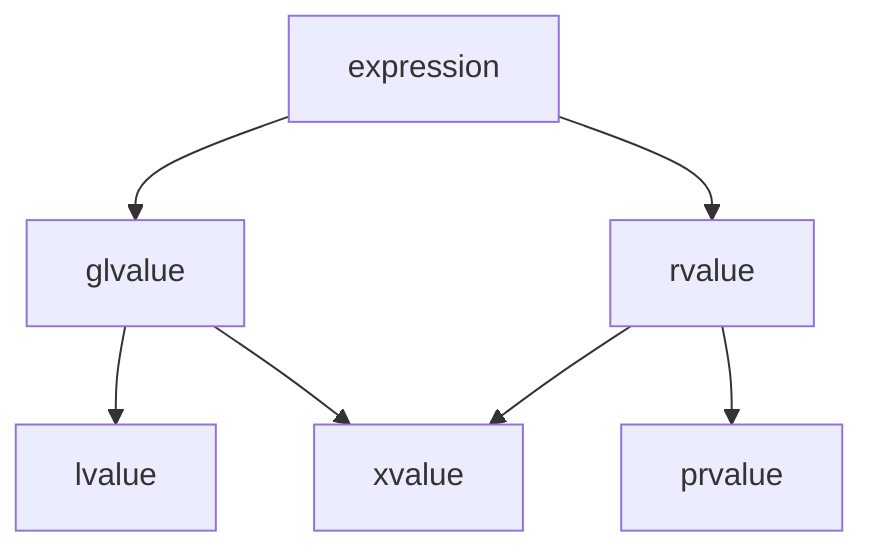

# C++

> 可参考文档
> - 正式标准: C++ 的标准由 `ISO/IEC` 发布, 最新版本包括(`C++23(ISO/IEC 14882:2023)`, `C++20(ISO/IEC 14882:2020)`, `C++17(ISO/IEC 14882:2017)`, `C++14(ISO/IEC 14882:2014)`, `C++11(ISO/IEC 14882:2011)`)
>   * 需要付费购买, 参[ISO Store](https://www.iso.org/standard/79358.html)/[ANSI Webstore](https://webstore.ansi.org/)
> - 免费草案(Draft Standards): 官方标准发布前的草案(接近最终版)通常免费公开, 参阅[WG21](https://www.open-std.org/jtc1/sc22/wg21/)
> - 权威的C++参考网站
>   * [cppreference](https://en.cppreference.com/w/), C++ 标准库和语言特性文档, 包含各版本的标志宏
>   * [C++ Standards Committee Papers](https://wg21.link/), C++的提案和演进记录
> - libc++源码:
>   * [镜像获取gcc源码](https://mirrors.ustc.edu.cn/gnu/gcc/gcc-13.2.0/gcc-13.2.0.tar.xz)
> - C++编译器文档:
>   * [GNU-GCC/G++](https://gcc.gnu.org/onlinedocs/gcc/Option-Summary.html)
>   * [Clang](https://clang.llvm.org/docs/ClangCommandLineReference.html)
>   * [MSVC](https://learn.microsoft.com/en-us/cpp/build/reference/compiler-options-listed-by-category)
> - man手册文档:
>   * [gun镜像站](https://gcc.gnu.org/mirrors.html)

## 定义

- 函数指针 `int (*function_pointer)(int, int);`
- 成员函数指针 `typedef void (Receiver::*Action)();` C++98支持
    > `(Receiver::*Action)`: 名为 Action 的指针，指向 Receiver 类的成员函数
    > 使用如: `(receiver->*Action)()`

## 术语

### 字符串字面量(string literal)

字符串字面量是有双引号扩起来的字符序列, 支持前缀有 `R`, `u8`, `u8R`, `u`, `uR`, `U`, `UR`, `L`, or `LR`, 如 `"..."`, `R"(...)"`, `u8"..."`, `u8R"**(...)**"`, `u"..."`,
`uR"*~(...)*~"`, `U"..."`, `UR"zzz(...)zzz"`, `L"..."`, or `LR"(...)"`

### cv限定符

cv 限定符是 `const` 和 `volatile` 关键字的统称

- `const`: 表示一个变量是不可修改的常量, 即它的值在初始化后不能再被修改。对 const 变量的修改会导致编译错误。
- `volatile`: 告诉编译器, 该变量的值可能会在意料之外的时间改变(由硬件更改或者多线程更改), 因此编译器不应该对该变量的访问进行优化(禁止变量访问的缓存优化)

**注意** `volatile` 和普通的对象不一样，如果对象是 `volatile` 的，则只能调用 `volatile` 成员函数；其拷贝需要实现 `volatile`成员函数

### 值类别(value categories)

value categories是理解表达式如何求值、移动语义和完美转发的关键

C++11将原有的 lvalue 和 rvalue(C++98) 细分为五种: `lvalue`/`xvalue`/`prvalue`/`glvalue`/`rvalue`

> 原C++98中: 
> - 左值(lvalue)为可以取地址、有名字的持久对象，如变量、函数返回的左值引用
> - 右值(rvalue)为临时对象、字面量，如42、x+y的结果

> C++11中, 引入移动语义, 值类别被细分为:
> - `lvalue`: 有名字、可取地址的表达式, 如int a; a 是 lvalue
> - `prvalue`: 纯右值（临时对象、字面量）, 如42, x+y, func()
> - `xvalue`: “将亡值”（可被移动的右值）, 如std::move(x), 右值引用返回值
> - `glvalue`: 广义左值（lvalue + xvalue）, 如所有具名表达式
> - `rvalue`: 右值（prvalue + xvalue）, 如临时对象、std::move(x)



### lambda

> Lambda表达式提供了一种简洁的方法来创建简单的函数对象
> Lambda表达式的语法定义如下:
```
lambda-expression:
    lambda-introducer lambda-declarator_opt compound-statement
lambda-introducer:
    [ lambda-capture_opt ]
lambda-capture:
    capture-default
    capture-list
    capture-default , capture-list
capture-default:
    &
    =
capture-list:
    capture ...opt
    capture-list , capture ...opt
capture:
    identifier
    & identifier
    this
lambda-declarator:
    ( parameter-declaration-clause ) mutable_opt
        exception-specification_opt attribute-specifier-seq_opt trailing-return-type_opt
```

1. 表达式会生成prvalue临时对象(又叫闭包)

2. 捕获列表capture定义 lambda 表达式可以访问的外部变量, 如
> - `[]`: 不捕获任何变量
> - `[=]`: 以值方式捕获所有外部变量
> - `[&]`: 以引用方式捕获所有外部变量
> - `[x, &y]`: 以值捕获x，以引用捕获y
> - `[this]`: 捕获当前类的this指针

3.  参数列表parameters类似于普通函数参数列表, 但有以下限制:
> - 不能有默认参数
> - 不支持可变参数模板
> - 参数类型可以省略(自动推导)

### 覆盖(Override)/隐藏(Hiding)/重载(Overload)/重写(Rewrite)

|术语	            |关键区别	                   |多态性	|签名要求	      |关键字/场景  |
|-------------------|-----------------------------|-------|-----------------|------------|
|覆盖(Override)	    |派生类覆盖基类虚函数	        |是	     |必须完全相同	   |virtual + override|
|隐藏(Hiding)	    |派生类隐藏基类同名函数（非虚）	 |否	  |函数名相同即可	|无（通常意外发生）|
|重载(Overload)	    |同一作用域的同名函数	        |否      |参数列表必须不同  |无|
|重写(Rewrite)      |非标准术语,在 C++ 中无明确定义  |       |                 ||

### 位域
> 参`cpp11标准文档`(9.6 chapt:Bit-fields)

`identifier_opt attribute-specifier-seq_opt: constant-expression`

声明一个具有显式大小(以位bit为单位)的类数据成员.相邻的位域成员可以（也可能不）被打包以共享和跨越各个字节

<!-- 它的长度由一个冒号与位域名称区分开来。
可选的属性指定符seq属于被声明的实体。
位域属性不是类成员类型的一部分。 -->

**注意** 整型常量表达式的值可以大于位字段类型的对象表示中的位数, 此时额外的位被用作填充位, 而不参与位域的值表示
**注意** 位字段的分配和对齐由实现定义(非标准行为), 打包时可能跨分配单元, 分配时可能从右到左或从左到右

### RAII

RAII(Resource Acquisition Is Initialization, 资源请求即初始化), 由Bjarne Stroustrup提出, 被称为使用局部对象来管理资源的技术(他的生命机制由操作系统完成, 无需人工介入)

### ADL(Argument-dependent lookup, 参数依赖查找)

参数相关查找（ADL），也称为 Koenig 查找 [1] ，是一组用于在函数调用表达式中查找未限定函数名的规则，包括对重载运算符的隐式函数调用。这些函数名除了在通常未限定名查找所考虑的作用域和命名空间外，还会在其参数的命名空间中查找。

> cpp的adl有一些问题, 会造成各种隐式空间名称泄漏问题, 一个典型的示例如下

```cpp
namespace N1 {
    struct S {};
    template<int X>
    void f(S);
}
 
namespace N2 {
    template<class T>
    void f(T t);
}
 
void g(N1::S s) {
    f<3>(s);     // Syntax error until C++20 (unqualified lookup finds no f)
    N1::f<3>(s); // OK, qualified lookup finds the template 'f'
    N2::f<3>(s); // Error: N2::f does not take a constant parameter
                 //        N1::f is not looked up because ADL only works
                 //              with unqualified names
    using N2::f;
    f<3>(s); // OK: Unqualified lookup now finds N2::f
             //     then ADL kicks in because this name is unqualified
             //     and finds N1::f
}
```

> 同时ADL进行name lookup时, 无法使用 public/private 之类的 access specifier, 这意味着继承下名称的异常问题

### Compile-Time String(编译期字符串)/Compile-Time String Hashing(编译期字符串哈希优化)

编译期字符串/编译期字符串哈希优化 是实践中总结的概念, cpp标准中并没有明确提出, 是利用`constexpr`(编译期表达式)/`Template`构建的一致编程技术.

> 参考:
- [ctti-cpp11支持的编译期类型名](https://github.com/Manu343726/ctti)

### traits(特性/特质)

traits主要用于在编译时获取和操作类型的信息。本质上是一系列模板类，通过特化(specialization) 来为不同的类型提供统一的接口和类型信息。

> Traits 是一种"类型萃取"技术，它允许我们在编译期间获取类型的各种特性信息，如:
- 类型是否是 POD(Plain Old Data)
- 类型是否有平凡的构造函数
- 类型的各种属性信息
- 类型之间的关系

### POD/Trivial Type/Standard Layout

1. `Trivial type` 普通/平凡类型, 属于C++术语概念
> 当一个类型(class/struct) 同时满足以下几个条件时, 它是 trivial type:
- 没有虚函数或虚基类
- 由编译器生成默认的特殊成员函数，包括默认构造函数、拷贝构造函数、移动构造函数、赋值运算符、移动赋值运算符和析构函数
- 数据成员同样需要满足条件 1 和 2

2. `Standard Layout` 标准内存布局
> `class/struct` 同时满足以下几个条件时是标准布局(standard-layout)类型:
- 没有虚函数或虚基类
- 所有非静态数据成员都具有相同的访问说明符(`public/protected/private`)
- 在继承体系中最多只有一个类中有非静态数据成员
- 子类中的第一个非静态成员的类型与其基类不同

> 注意: 要求 `子类中的第一个非静态成员的类型与其基类不同` 是因为 C++ 允许优化`无成员的基类(即空基类)`
> 在 C++ 标准中, 如果基类没有任何数据成员, 基类应不占用空间。因此 C++ 标准允许派生类的第一个成员与基类共享同一地址空间
> 但是, 如果派生类的第一个非静态成员的类型和基类相同, 由于 C++ 标准要求相同类型的不同对象的地址必须不同, 编译器就会为基类分派一个字节的地址空间, 如:

```cpp
struct A {};

struct B : public A {
    char a;
    A b;
};

struct C : public A {
    A a;
    char b;
};
std::cout << "A:" << sizeof(A) << std::endl; // A:1
std::cout << "B:" << sizeof(B) << std::endl; // B:2
std::cout << "C:" << sizeof(C) << std::endl; // C:3
// A内存布局: [1字节(C++规定任何对象都必须有唯一的地址,空类也会占用至少1字节的空间)]
// B内存布局(空基类优化): [继承的A|char b(共用1字节)][A a(1字节)]
// C内存布局: [继承的A(1字节)][A a(1字节)][char b(1字节)]
```

3. `POD(Plain Old Data)`, 是从 C++11 开始引入的概念。
> `Plain` 代表一个对象是一个普通类型；`Old` 代表一个对象可以与 C 语言兼容。具有以下特点:
- 可以使用字节赋值，比如用 `memset`、`memcpy` 对 `POD` 类型对象进行赋值操作。
- 与 C 语言内存布局兼容，POD 类型的数据可以使用 C 函数进行操作且是安全的。
- 保证了静态初始化的安全有效。

> C++ 提供了 `std::is_pod<T>` 来判断一个类型是不是 `POD` 类型

**注意**  C++20 开始, `POD` 这个概念被开始淡化, `std::is_pod<T>` 这个模板库也被废弃, 转而用 `trivial` 和 `standard-layout` 两个概念代替, 如果一个对象既是 `trivial` 又是 `standard-layout`, 那么这个对象就是 POD 类型

### Object lifetime(对象生命周期)

对象的生存期是对象的运行时属性。
> 如果一个对象属于类或聚合类型，并且它或它的成员之一由平凡默认构造函数之外的构造函数初始化，则称对象具有非平凡的初始化
**注** 平凡复制/移动构造函数的初始化是非平凡初始化

> 类型T的对象的生命周期开始于:
- 已获取类型T的正确对齐方式和大小的存储空间
- 如果对象具有非平凡初始化, 则初始化完成

## 关键字

### explicit

> 主要用于防止构造函数的隐式类型转换, 提高代码的安全性和可读性

explicit关键字用于**修饰类的构造函数**, 表示该构造函数必须显式调用, 不能用于隐式转换

> Example:
```c
Point p1(1, 2);       // 正确：显式调用
Point p2 = {1, 2};    // 错误：explicit阻止列表初始化隐式转换
drawPoint({1, 2});    // 错误：explicit阻止隐式转换
```

### decltype

> 检查实体的声明类型, 或表达式的类型和值类别(从C++11开始)

> Example:
```cpp
int i = 33;
decltype(i) j = i * 2;  // j类型为int
decltype((i)) j = i;  // j类型为int&

auto f = [](int a, int b) -> int
{
    return a * b;
};

decltype(f) g = f; // lambda 的类型是独有且无名
i = f(2, 2);
j = g(3, 3);
```

**注意** decltype在获取lambda函数类型时必须使用(因为lambda类型独有且无名)

### override

override 是可选的(但强烈推荐), 从语法上讲, 不加 override 也能编译通过,但显式使用 override 有检查优势:
- 编译器检查函数签名: override 会让编译器检查派生类函数是否真的覆盖了基类的虚函数(如果签名不匹配,如参数类型、const 修饰符不同，会直接报错)
- 代码可读性: 明确表明函数是覆盖基类行为，而非派生类新增的虚函数
- 防止意外隐藏: 避免因函数名相同但签名不同导致的基类函数被隐藏(无 override 时可能静默发生)

> override 是 C++11 引入的，旧代码无法使用
> override 仅用于标记派生类函数显式覆盖基类虚函数(无论纯虚还是非纯虚)

### `enum class`/`enum struct`/`enum`

enum声明的是无作用域的枚举类型, 而`enum class`/`enum struct`的枚举项具有作用域
> 枚举项被声明为常量, 使用`=`将关联的枚举项赋予常量表达式表示的值(必须是整型常量表达式), 第一项没有初始化器时默认为0, 后一项由前一枚举项的值+1得到
> `enum class`/`enum struct`定义的项不支持隐式的类型转换, 如:
```cpp
enum class Col { red, yellow, green };
int x = Col::red; // error: no Col to int conversion
Col y = Col::red; 
Col z = red;  // error: red not in scope
if (y) { } // error: no Col to bool conversion
int i = static_cast<int>(y);  //OK
```
> 如果定义在类中, 可通过 `::`/`.(dot)`/`->` 访问

### dynamic_cast/static_cast/reinterpret_cast/const_cast

Explicit type conversion(明确类型转换), 参cpp11-5.4章节

> 允许的转换操作:
- `reinterpret_cast`: 用于低级别的指针类型转换
- `static_cast<T>(v)`: 用于将表达式v的值转为类型T
- `static_cast<T>(const_cast<U>(v))`: 
- `const_cast<T&>(v)`: 更改类型限定符(只能操作同类型)和部分值类别转换, **转换的结果指针/引用指向原始对象**
- `reinterpret_cast`

> `const_cast` 转换示例:
* `const_cast<T2&>`: lvalue --> lvalue
* `const_cast<T2&&>`: glvalue --> xvalue
* `const_cast<T2&>`: pvalue --> xvalue, 这里的prvalue必须是类类型, 基本类型不行

**注意** `const_cast` 移除 `const` 限定符后的写入是UB行为

### alignof

`alignof( type-id )` 获取操作数类型的对齐要求(操作数必须是类型标识符, 表示一个完整的对象类型;该类型的数组;对给类型的引用), 编译期操作(只读)

> alignof应用于引用类型, 结构因为所引用类型的对齐方式
> alignof应用于数组类型, 结构因为数组元素类型的对齐方式

### alignas

变量或类型的对齐说明符, 使用其可更改变量或数组首地址的对齐要求

> `alignas(type-id)`和`alignas(alignof(typeid))`相同
> 如果想数组的每个元素均以`alignas`对齐, 可以使用结构体封装, 如
```c
struct alignas(16) AlignedElement {
    int value;
};
AlignedElement arr[4];  // 每个元素都 16 字节对齐
```

### noexcept

参cpp-11
```c
noexcept-expression:
noexcept ( expression)
```
确定一个操作是否引发异常, `noexcept(false)` 表示可能引发异常, 从而使编译器和运行时系统做出相应优化

### new

创建一个 类型为 `type-id` / `new-type-id` 的对象

**注意**
- `type-id` 可能具有 cv 限定符，此时 表达式结果也具有 cv限定类型

```cpp
new T  // results in a call of operator new(sizeof(T)),
new(2,f) // T results in a call of operator new(sizeof(T),2,f),
new T[5] // results in a call of operator new[](sizeof(T)*5+x), and
new(2,f) // T[5] results in a call of operator new[](sizeof(T)*5+y,2,f)
```

### delete

## 专属类型

### 智能指针

#### std::shared_ptr

> 初始化的几种方式:
```cpp
// cpp11
std::shared_ptr<int> t = std::make_shared<int>();
std::shared_ptr<int> t2 = t;
int* p = new int;
std::shared_ptr<int> t3(p);
std::shared_ptr<int> t4;
t4.reset(p);

```

#### std::unique_ptr

> > 初始化的几种方式:
```cpp
// cpp11
```
#### 自定义删除器

##### 自定义删除器的拷贝行为

|操作	                                            |删除器是否跟随	|说明|
|---------------------------------------------------|--------------|---|
|`拷贝构造 (shared_ptr<T> p2 = p1)`	                |是	    |删除器一并复制|
|`移动构造 (shared_ptr<T> p3 = std::move(p1))`	    |是	    |删除器被移动|
|`p1 = p2（赋值另一个 shared_ptr）`	                |是	    |采用右侧的删除器|
|`p1.reset(new T)`                                 |否	    |默认用 delete|
|`p1.reset(new T, deleter)`	                       |是	    |需显式指定新删除器|

### 关联容器

#### std::map

- 底层为红黑树
- key唯一
- 按键升序排序
- 查找时间复杂度 `O(log n)`
- 插入时间复杂度 `O(log n)`

#### std::multimap

- 底层为红黑树
- key可重复
- 按键升序排序
- 查找时间复杂度 `O(log n)`
- 插入时间复杂度 `O(log n)`

#### std::unordered_map

- 底层为哈希表
- key唯一
- 无序
- 查找时间复杂度 `O(1)`(平均)
- 插入时间复杂度 `O(1)`(平均)

## 多态

> 编译问题
> - 多态的非纯虚函数必须存在定义,不然依赖项目ld链接时会报vtable无法引用

### 动态类型转换 `dynamic_pointer_cast`/`dynamic_cast`

dynamic_pointer_cast 和 dynamic_cast 都是 C++ 中用于安全向下转型(downcasting)的工具, 其中:

- dynamic_cast: 用于 裸指针（raw pointers） 或 引用 的运行时类型检查和安全转换
> 主要处理继承体系中的多态类型（必须有虚函数）
- dynamic_pointer_cast: 用于 std::shared_ptr 智能指针 的运行时类型检查和安全转换
> C++ 标准库为智能指针提供的工具，底层仍依赖 dynamic_cast

## 多线程/多进程

### std::memory_order

多核系统中，编译器和处理器可能会对指令进行 重排序（如优化指令流水线），导致多线程程序出现意外的行为。memory_order 的作用是：

控制原子操作的同步行为：确保线程间数据的可见性和顺序。

避免不必要的同步开销：在保证正确性的前提下提升性能。

## 模板Template

[cpp-template笔记](./cpp_template.md)

## 编译期运算

[cpp编译计算笔记](./cpp_compile_calculation.md)

## 正则表达式

cpp 通过 `<regex>` 提供对正则的基本支持, 正则表达式引擎在编译器处理字符串字面量之后处理, 因此需要进行转义, 如字面量 `\\d` 匹配数字, 使用原始字面量 `R"(...)"` 可以避免双反斜杠转义

> example:
```cpp
std::regex pattern(R"((\d+\.\d+\.\d+).*?([A-Za-z0-9]+)\s+(\d{1,2})\s+(\d+:\d+:\d+)\s+[a-zA-Z0-9]+\s+(\d{4}))");  // 编译一个正常表达式对象, 错误抛出异常
std::smatch match;
std::regex_search(uname_str, match, pattern); // 在字符串中搜索第一个与正则表达式匹配的部分
std::regex_match // 检查整个字符串是否与正则表达式匹配。
std::regex_replace // 替换字符串中与正则表达式匹配的部分。
std::sregex_iterator // 迭代器，用于遍历所有匹配项
```

## 易混点

### 函数默认参数相关

- 如果在 `函数声明` 和 `函数定义` 中都为参数提供默认值，则编译器无法确定使用那个默认值从而报错

### 类的const成员函数和非const成员函数构成重载关系

> const成员函数在底层有不同类型的this指针(`const T* this`), 因此对于看似相同参数签名的两个成员函数构成重载关系
```cpp
class Test {
public:
    // 这两个函数构成重载，因为const成员函数签名不同
    void func() { std::cout << "non-const\n"; }
    void func() const { std::cout << "const\n"; }
}
```

**注意** 顶层const(top-level const)不区分重载, 如:
```cpp
// 重复定义
int f(int*);
int f(int* const);

// 重载
int g(char*);
int g(const char*);
```

### 返回引用的生命周期问题

```cpp
#include <iostream>

const int& min(const int& a, const int& b) {
    return a < b ? a : b;
}

const int& bad_reference() {
    return min(12, 90);  // 明显返回临时对象的引用
}

int main() {
    const int& a = bad_reference();
    
    // 可能正常工作...
    std::cout << "Value: " << a << std::endl;
    
    // 但进行其他操作后可能出问题
    int array[1000];
    for(int i = 0; i < 1000; i++) {
        array[i] = i;  // 可能覆盖之前临时对象的内存
    }
    
    // 现在可能得到错误的值！
    std::cout << "Value after memory usage: " << a << std::endl;
    
    return 0;
}
```

### `const T&` 会延长临时变量的生命周期至引用的生命周期

- `const T&` 作为函数参数接受临时变量并自动延长临时变量生命周期
- `const T&` 使用函数返回的临时变量进行初始化, 减少一次拷贝操作

### 6大默认成员函数的生成机制

> 生成时机:
- 默认构造函数: 没有定义任何构造函数时生成
    > `ClassName()`
    > 按成员默认初始化（基础类型不初始化，类类型调用其默认构造）
    > 定义了任意构造函数，则不会生成默认构造函数
- 默认析构函数: 始终自动生成（除非用户定义）
    > `~ClassName()`
    > 按成员调用析构函数（基础类型无操作）
- 默认拷贝构造函数: 当没有定义拷贝构造时生成
    > `ClassName(const ClassName&)`
    > 按成员拷贝（浅拷贝）
    > 如果类中有不可拷贝的成员（如 unique_ptr），则不会自动生成
- 默认拷贝赋值运算符
    > `ClassName& operator=(const ClassName&)`
    > 当没有定义拷贝赋值时生成
    > 类中有不可赋值的成员，则不会生成
- 默认移动构造函数（C++11 起）
    > `ClassName(ClassName&&)`
    > 当没有定义**移动构造、拷贝构造、拷贝赋值、析构函数**时生成
    > 按成员移动（对类类型调用移动构造，基础类型直接拷贝）
- 默认移动赋值运算符（C++11 起）
    > `ClassName& operator=(ClassName&&)`
    > 当没有定义**移动赋值、拷贝构造、拷贝赋值、析构函数**时生成
    > 按成员移动赋值

> 注意:
- 如果定义了**拷贝构造、拷贝赋值、析构函数**中的任何一个，应考虑是否要定义其他相关函数（特别是移动操作可能不会自动生成）
- 隐式生成函数是 public 且 inline 的
- 自动生成的函数可能不适用于资源管理类（如需要深拷贝时）
- C++11 前只有前四个函数（没有移动操作）
- 声明即用户接管定义