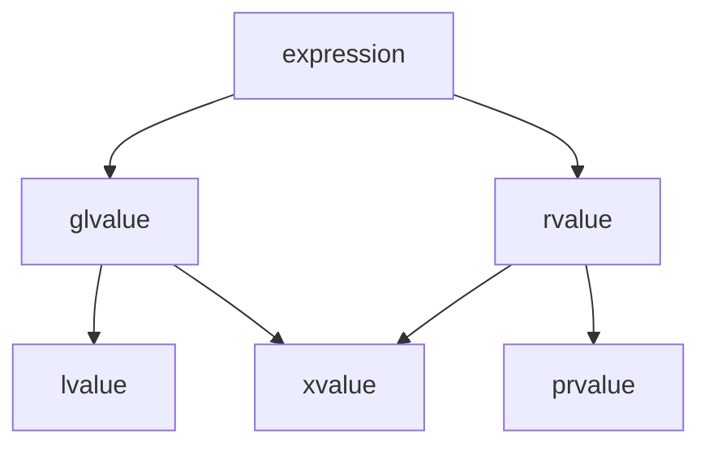

# C++

> 可参考文档
> - 正式标准: C++ 的标准由 `ISO/IEC` 发布, 最新版本包括(`C++23(ISO/IEC 14882:2023)`, `C++20(ISO/IEC 14882:2020)`, `C++17(ISO/IEC 14882:2017)`, `C++14(ISO/IEC 14882:2014)`, `C++11(ISO/IEC 14882:2011)`)
>   * 需要付费购买, 参[ISO Store](https://www.iso.org/standard/79358.html)/[ANSI Webstore](https://webstore.ansi.org/)
> - 免费草案(Draft Standards): 官方标准发布前的草案(接近最终版)通常免费公开, 参阅[WG21](https://www.open-std.org/jtc1/sc22/wg21/)
> - 权威的C++参考网站
>   * [cppreference](https://en.cppreference.com/w/), C++ 标准库和语言特性文档, 包含各版本的标志宏
>   * [C++ Standards Committee Papers](https://wg21.link/), C++的提案和演进记录
> - C++编译器文档:
>   * [GNU-GCC/G++](https://gcc.gnu.org/onlinedocs/gcc/Option-Summary.html)
>   * [Clang](https://clang.llvm.org/docs/ClangCommandLineReference.html)
>   * [MSVC](https://learn.microsoft.com/en-us/cpp/build/reference/compiler-options-listed-by-category)
> - man手册文档:
>   * [gun镜像站](https://gcc.gnu.org/mirrors.html)

## 定义

- 函数指针 `int (*function_pointer)(int, int);`

## 术语

### 值类别(value categories)

value categories是理解表达式如何求值、移动语义和完美转发的关键

C++11将原有的 lvalue 和 rvalue(C++98) 细分为五种: `lvalue`/`xvalue`/`prvalue`/`glvalue`/`rvalue`

> 原C++98中: 
> - 左值(lvalue)为可以取地址、有名字的持久对象，如变量、函数返回的左值引用
> - 右值(rvalue)为临时对象、字面量，如42、x+y的结果

> C++11中, 引入移动语义, 值类别被细分为:
> - `lvalue`: 有名字、可取地址的表达式, 如int a; a 是 lvalue
> - `prvalue`: 纯右值（临时对象、字面量）, 如42, x+y, func()
> - `xvalue`: “将亡值”（可被移动的右值）, 如std::move(x), 右值引用返回值
> - `glvalue`: 广义左值（lvalue + xvalue）, 如所有具名表达式
> - `rvalue`: 右值（prvalue + xvalue）, 如临时对象、std::move(x)



### lambda

> Lambda表达式提供了一种简洁的方法来创建简单的函数对象
> Lambda表达式的语法定义如下:
```
lambda-expression:
    lambda-introducer lambda-declarator_opt compound-statement
lambda-introducer:
    [ lambda-capture_opt ]
lambda-capture:
    capture-default
    capture-list
    capture-default , capture-list
capture-default:
    &
    =
capture-list:
    capture ...opt
    capture-list , capture ...opt
capture:
    identifier
    & identifier
    this
lambda-declarator:
    ( parameter-declaration-clause ) mutable_opt
        exception-specification_opt attribute-specifier-seq_opt trailing-return-type_opt
```

1. 表达式会生成prvalue临时对象(又叫闭包)

2. 捕获列表capture定义 lambda 表达式可以访问的外部变量, 如
> - `[]`: 不捕获任何变量
> - `[=]`: 以值方式捕获所有外部变量
> - `[&]`: 以引用方式捕获所有外部变量
> - `[x, &y]`: 以值捕获x，以引用捕获y
> - `[this]`: 捕获当前类的this指针

3.  参数列表parameters类似于普通函数参数列表, 但有以下限制:
> - 不能有默认参数
> - 不支持可变参数模板
> - 参数类型可以省略(自动推导)

### 覆盖(Override)/隐藏(Hiding)/重载(Overload)/重写(Rewrite)

|术语	            |关键区别	                   |多态性	|签名要求	      |关键字/场景  |
|-------------------|-----------------------------|-------|-----------------|------------|
|覆盖(Override)	    |派生类覆盖基类虚函数	        |是	     |必须完全相同	   |virtual + override|
|隐藏(Hiding)	    |派生类隐藏基类同名函数（非虚）	 |否	  |函数名相同即可	|无（通常意外发生）|
|重载(Overload)	    |同一作用域的同名函数	        |否      |参数列表必须不同  |无|
|重写(Rewrite)      |非标准术语,在 C++ 中无明确定义  |       |                 ||

### 位域
> 参`cpp11标准文档`(9.6 chapt:Bit-fields)

`identifier_opt attribute-specifier-seq_opt: constant-expression`

声明一个具有显式大小(以位bit为单位)的类数据成员.相邻的位域成员可以（也可能不）被打包以共享和跨越各个字节

<!-- 它的长度由一个冒号与位域名称区分开来。
可选的属性指定符seq属于被声明的实体。
位域属性不是类成员类型的一部分。 -->

**注意** 整型常量表达式的值可以大于位字段类型的对象表示中的位数, 此时额外的位被用作填充位, 而不参与位域的值表示
**注意** 位字段的分配和对齐由实现定义(非标准行为), 打包时可能跨分配单元, 分配时可能从右到左或从左到右

## 关键字

### explicit

> 主要用于防止构造函数的隐式类型转换, 提高代码的安全性和可读性

explicit关键字用于**修饰类的构造函数**, 表示该构造函数必须显式调用, 不能用于隐式转换

> Example:
```c
Point p1(1, 2);       // 正确：显式调用
Point p2 = {1, 2};    // 错误：explicit阻止列表初始化隐式转换
drawPoint({1, 2});    // 错误：explicit阻止隐式转换
```

### decltype

> 检查实体的声明类型, 或表达式的类型和值类别(从C++11开始)

> Example:
```cpp
int i = 33;
decltype(i) j = i * 2;  // j类型为int
decltype((i)) j = i;  // j类型为int&

auto f = [](int a, int b) -> int
{
    return a * b;
};

decltype(f) g = f; // lambda 的类型是独有且无名
i = f(2, 2);
j = g(3, 3);
```

**注意** decltype在获取lambda函数类型时必须使用(因为lambda类型独有且无名)

### override

override 是可选的(但强烈推荐), 从语法上讲, 不加 override 也能编译通过,但显式使用 override 有检查优势:
- 编译器检查函数签名: override 会让编译器检查派生类函数是否真的覆盖了基类的虚函数(如果签名不匹配,如参数类型、const 修饰符不同，会直接报错)
- 代码可读性: 明确表明函数是覆盖基类行为，而非派生类新增的虚函数
- 防止意外隐藏: 避免因函数名相同但签名不同导致的基类函数被隐藏(无 override 时可能静默发生)

> override 是 C++11 引入的，旧代码无法使用
> override 仅用于标记派生类函数显式覆盖基类虚函数(无论纯虚还是非纯虚)

### `enum class`/`enum struct`/`enum`

enum声明的是无作用域的枚举类型, 而`enum class`/`enum struct`的枚举项具有作用域
> 枚举项被声明为常量, 使用`=`将关联的枚举项赋予常量表达式表示的值(必须是整型常量表达式), 第一项没有初始化器时默认为0, 后一项由前一枚举项的值+1得到
> `enum class`/`enum struct`定义的项不支持隐式的类型转换, 如:
```cpp
enum class Col { red, yellow, green };
int x = Col::red; // error: no Col to int conversion
Col y = Col::red; 
Col z = red;  // error: red not in scope
if (y) { } // error: no Col to bool conversion
```
> 如果定义在类中, 可通过 `::`/`.(dot)`/`->` 访问

### dynamic_cast/static_cast/reinterpret_cast/const_cast

Explicit type conversion(明确类型转换), 参cpp11-5.4章节
- reinterpret_cast: 用于低级别的指针类型转换

## 智能指针

### std::shared_ptr

## 多态

### 动态类型转换 `dynamic_pointer_cast`/`dynamic_cast`

dynamic_pointer_cast 和 dynamic_cast 都是 C++ 中用于安全向下转型(downcasting)的工具, 其中:

- dynamic_cast: 用于 裸指针（raw pointers） 或 引用 的运行时类型检查和安全转换
> 主要处理继承体系中的多态类型（必须有虚函数）
- dynamic_pointer_cast: 用于 std::shared_ptr 智能指针 的运行时类型检查和安全转换
> C++ 标准库为智能指针提供的工具，底层仍依赖 dynamic_cast

## 多线程/多进程

### std::memory_order

多核系统中，编译器和处理器可能会对指令进行 重排序（如优化指令流水线），导致多线程程序出现意外的行为。memory_order 的作用是：

控制原子操作的同步行为：确保线程间数据的可见性和顺序。

避免不必要的同步开销：在保证正确性的前提下提升性能。

## 模板Template

## 工程示例

### 函数默认参数相关

- 如果在 `函数声明` 和 `函数定义` 中都为参数提供默认值，则编译器无法确定使用那个默认值从而报错