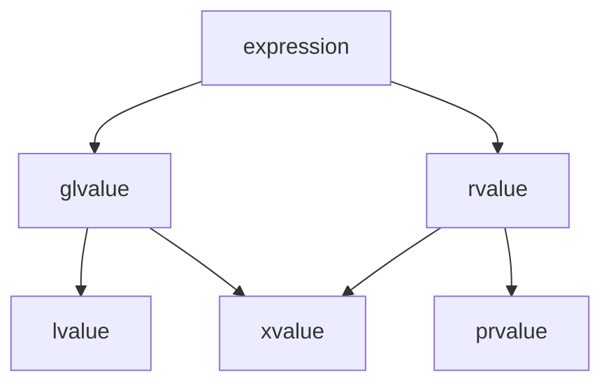

# C++

> 可参考文档
> - 正式标准: C++ 的标准由 `ISO/IEC` 发布, 最新版本包括(`C++23(ISO/IEC 14882:2023)`, `C++20(ISO/IEC 14882:2020)`, `C++17(ISO/IEC 14882:2017)`, `C++14(ISO/IEC 14882:2014)`, `C++11(ISO/IEC 14882:2011)`)
>   * 需要付费购买, 参[ISO Store](https://www.iso.org/standard/79358.html)/[ANSI Webstore](https://webstore.ansi.org/)
> - 免费草案(Draft Standards): 官方标准发布前的草案(接近最终版)通常免费公开, 参阅[WG21](https://www.open-std.org/jtc1/sc22/wg21/)
> - 权威的C++参考网站
>   * [cppreference](https://en.cppreference.com/w/), C++ 标准库和语言特性文档, 包含各版本的标志宏
>   * [C++ Standards Committee Papers](https://wg21.link/), C++的提案和演进记录
> - C++编译器文档:
>   * [GNU-GCC/G++](https://gcc.gnu.org/onlinedocs/gcc/Option-Summary.html)
>   * [Clang](https://clang.llvm.org/docs/ClangCommandLineReference.html)
>   * [MSVC](https://learn.microsoft.com/en-us/cpp/build/reference/compiler-options-listed-by-category)

## 定义

- 函数指针 `int (*function_pointer)(int, int);`

## 术语

### 值类别(value categories)

value categories是理解表达式如何求值、移动语义和完美转发的关键

C++11将原有的 lvalue 和 rvalue(C++98) 细分为五种: `lvalue`/`xvalue`/`prvalue`/`glvalue`/`rvalue`

> 原C++98中: 
> - 左值(lvalue)为可以取地址、有名字的持久对象，如变量、函数返回的左值引用
> - 右值(rvalue)为临时对象、字面量，如42、x+y的结果

> C++11中, 引入移动语义, 值类别被细分为:
> - `lvalue`: 有名字、可取地址的表达式, 如int a; a 是 lvalue
> - `prvalue`: 纯右值（临时对象、字面量）, 如42, x+y, func()
> - `xvalue`: “将亡值”（可被移动的右值）, 如std::move(x), 右值引用返回值
> - `glvalue`: 广义左值（lvalue + xvalue）, 如所有具名表达式
> - `rvalue`: 右值（prvalue + xvalue）, 如临时对象、std::move(x)



## 关键字

### explicit

> 主要用于防止构造函数的隐式类型转换, 提高代码的安全性和可读性

explicit关键字用于**修饰类的构造函数**, 表示该构造函数必须显式调用, 不能用于隐式转换

> Example:
```c
Point p1(1, 2);       // 正确：显式调用
Point p2 = {1, 2};    // 错误：explicit阻止列表初始化隐式转换
drawPoint({1, 2});    // 错误：explicit阻止隐式转换
```

### decltype

> 检查实体的声明类型, 或表达式的类型和值类别(从C++11开始)

> Example:
```cpp
int i = 33;
decltype(i) j = i * 2;  // j类型为int
decltype((i)) j = i;  // j类型为int&

auto f = [](int a, int b) -> int
{
    return a * b;
};

decltype(f) g = f; // lambda 的类型是独有且无名
i = f(2, 2);
j = g(3, 3);
```

**注意** decltype在获取lambda函数类型时必须使用(因为lambda类型独有且无名)

### lambda

> Lambda表达式提供了一种简洁的方法来创建简单的函数对象
> Lambda表达式的语法定义如下:
```
lambda-expression:
    lambda-introducer lambda-declarator_opt compound-statement
lambda-introducer:
    [ lambda-capture_opt ]
lambda-capture:
    capture-default
    capture-list
    capture-default , capture-list
capture-default:
    &
    =
capture-list:
    capture ...opt
    capture-list , capture ...opt
capture:
    identifier
    & identifier
    this
lambda-declarator:
    ( parameter-declaration-clause ) mutable_opt
        exception-specification_opt attribute-specifier-seq_opt trailing-return-type_opt
```
> 表达式会生成prvalue临时对象(又叫闭包)

## 智能指针

### std::shared_ptr


## 多线程/多进程

### std::memory_order

多核系统中，编译器和处理器可能会对指令进行 重排序（如优化指令流水线），导致多线程程序出现意外的行为。memory_order 的作用是：

控制原子操作的同步行为：确保线程间数据的可见性和顺序。

避免不必要的同步开销：在保证正确性的前提下提升性能。

