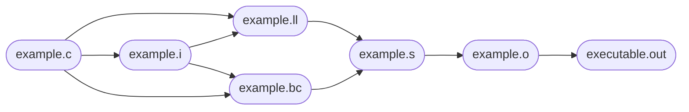

# clang
clang 是一个基于 LLVM(Low-Level Virtual Machine)项目的编译器前端，主要用于编译 C、C++、Objective-C 和 Objective-C++ 等语言。根据文件扩展名自动选择编译器。

> 其工作流程类似以下操作:
- 前端处理：Clang 作为前端，将源代码转换为抽象语法树（AST）。包括词法分析和语法分析，并生成中间表示（IR）。
- 优化器：生成的中间表示会被传递给 LLVM 的优化器进行优化。优化器会对代码进行各种优化，以提高代码的执行效率。
- 后端处理：优化后的中间表示会被传递给 LLVM 的后端，后端负责将中间表示IR转换为目标机器代码（汇编代码）。最后，汇编器和连接器会将汇编代码转换为可执行文件。

> 使用选项 `-ccc-print-phases`  查看clang处理流程
```sh
[root@13ce46f7167d c_dev_test]# clang -ccc-print-phases -U_NOT_DO test_goto.c 
            +- 0: input, "test_goto.c", c
         +- 1: preprocessor, {0}, cpp-output
      +- 2: compiler, {1}, ir
   +- 3: backend, {2}, assembler
+- 4: assembler, {3}, object
5: linker, {4}, image
```


> .c 为源码文件
> .i 为预处理文件
> .bc 为 bitcode文件，是clang的一种中间表示
> .ll 为一种文本化的中间表示，**可与 .bc 相互转换**
> .s 为汇编结果
> .o 为单文件生成的二进制文件
> .out 为最终输出的可执行文件

[参Clang用户手册](https://clang.llvm.org/docs/UsersManual.html)
[Clan中文手册](https://clang.llvm.net.cn/docs/UsersManual.html)

## 术语
Front end, parser, backend, preprocessor, undefined behavior, diagnostic, optimizer
前端, 解析器, 后端, 预处理器, 未定义行为, 诊断, 优化器

## 选项
```sh
-Werror 
    convert warnning to error
-Werror=foo
    convert warning "foo" into an error
-Wno-error=foo
    "foo"警告在指定 -Werror 的情况下也转换为警告(即指定Werror也不转换"foo"警告到错误)
-Wno-foo
    禁用"foo"警告
-w
    禁用所有诊断
-emit-llvm
    使用LLVM表示汇编和目标文件
-c
    只运行预处理、编译和组装步s骤
```

## 示例

### 使用clang编译并观察各阶段输出

> 参上述clang的工作流程
```sh
# .c -> .i
clang -E -c test.c -o test.i

# .c/.i -> .bc
clang -emit-llvm {test.c, test.i} -c -o test.bc

# .c/.i -> .ll
clang -emit-llvm {test.c, test.i} -S -o test.ll

# .bc -> .ll
llvm-dis test.bc -o test.ll

# .ll -> .bc
llvm-as test.ll -o test.bc

# 合并多个 .bc
llvm-link test1.bc test2.bc -o test.bc
```

## bug

原子库
如果您的程序使用了原子操作，并且编译器无法将所有操作直接降低到机器指令（因为要么没有已知的合适的机器指令，要么操作数已知不适合对齐），则将生成对运行时库 __atomic_* 函数的调用。这样的程序需要包含这些原子函数的运行时库。

compiler-rt (LLVM)
compiler-rt 包含原子库的实现。

libatomic (GNU)
libgcc_s 没有提供原子库的实现。相反，可以使用 GCC 的 libatomic 库 在使用 libgcc_s 时提供这些库。

注意

Clang 目前在使用 libgcc_s 时不会自动链接到 libatomic。您可能需要手动添加 -latomic 来支持在使用非本地原子操作时（如果您看到引用 __atomic_* 函数的链接错误）此配置。