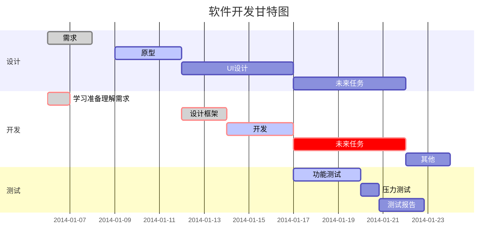

### markdown 基本内容

> - **元素**
>   > 元素分为块级和行级两大类
> - **标题**
>   > 总共六级,以#标识
> - **列表**
>   > 有两种格式：（有序列表以数字和‘.’标识，如 1.）||（无序列表以‘\*’或‘-’标识）
> - **区域块**
>   > 以\>加空格标识,可嵌套
> - **代码块**
>   > 格式如：\```代码内容```，其中标志符号为反引号
> - **表格**
>   > \
>   > | 左对齐 | 右对齐 | 居中对齐 |
>   > | :-----| ----: | :----: |
>   > | 单元格 | 单元格 | 单元格 |
>   > | 单元格 | 单元格 | 单元格 |

> - **链接和脚注**
>   > 链接格式：\[链接名](地址 "悬浮提示")
>   > 高级链接：链接变量应放置文档结尾赋值
>   > 应用：[链接名][链接变量名]
>   > 赋值：[链接变量名]:地址 "悬浮提示"
>   > 脚注格式：\[^脚注名]:内容，点击可跳转至说明部分,在文档尾.
>   > <u>示例如下</u>:
>   > [百度](baidu.com "悬浮提示") [高级][highLink] [脚注][^footNote] >>[^footNote]:脚注内容
> - **数学公式**
>   > 块级公式如：\$\$公式内容\$\$
>   > $$f(x)=x^2+\sum_{n=1}^{100}n $$
>   > 行级公式如：\$公式内容\$ $ f(x)=x^2+\sum\_{n=1}^{100}n $
> - **图**
>   > 流程图：graph LR（横向）/ TD（纵向）
>   >
>   > ```mermaid
>   > graph LR
>   > A[方形]-->B((圆))
>   > B-->C{条件}
>   > C-->|a==1| D(结果圆角)
>   > C-->|a==2| E[结果2]
>   > ```
>   >
>   > 时序图，示例如下：
>   >
>   > ```sequence
>   > 对象A -> 对象B: hello (请求)
>   > Note right of 对象B:对象B的描述文本
>   > Note left of 对象A:对象A的描述文本
>   > 对象B -> 对象A: he(响应)
>   > participant C
>   > 对象A-->>C:OK?
>   > Note over C,对象A: 联系
>   > ```



### markdown 其他

> - 高亮（以==包裹需要高亮显示的字符）
>   ==高亮==
> - 删除线（以~~包裹需要删除显示的字符）
>   ~~删除线~~
> - 分割线（三个‘\*’或‘-’为一行，中间以空格分隔，符‘-’可以不用空格分隔）
>
> ---
>
> ---
>
> ---
>
> - 可以使用 html 元素实现 markdown 不支持内容

[highLink]: #标题1 "高级链接悬浮提示"
