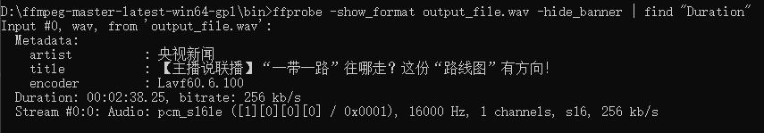
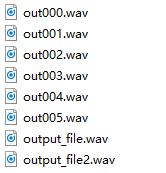

#### PaddleSpeech

PaddleSpeech 是基于飞桨 PaddlePaddle 的语音方向的开源模型库，用于语音和音频中的各种关键任务的开发，包含大量基于深度学习前沿和有影响力的模型，一些典型的应用示例如下：

[PaddleSpeech官网](https://github.com/PaddlePaddle/PaddleSpeech)

**PaddleSpeech快速上手**
```
python -m pip install --upgrade pip
pip  install paddlepaddle -i https://pypi.tuna.tsinghua.edu.cn/simple/

pip install pytest-runner -i https://pypi.tuna.tsinghua.edu.cn/simple/
pip install paddlespeech -i https://pypi.tuna.tsinghua.edu.cn/simple/

git clone https://github.com/PaddlePaddle/PaddleSpeech.git
cd PaddleSpeech
pip install pytest-runner
pip install .
```


#### ffmpeg视频转音频
```
ffmpeg -i 123.mp3 -acodec pcm_s16le -ar 16000 -ac 1 output_file.wav 

-i：输入文件;
-acodec：强制音频编解码器('copy '为复制原格式)
-ar：设置音频采样率(Hz)
-ac：设置音频通道的数量
```
#### ffprobe获取音频长度
```
ffprobe -show_format output_file.wav -hide_banner | find "Duration"
```
结果如下：



可以看到ffprobe是将文件信息一次性全部输出,
```
ffprobe - 1.mp3 -show_entries format=duration -v quiet -of csv="p=e"
```
#### ffmpeg分割音频
```
$ ffmpeg -i somefile.mp3 -f segment -segment_time 30 -c copy out%03d.mp3
参数详解：

-i：输入文件;
-f：强制格式，即目标格式，这里指定为 segment，即分割；
-segment_time：每段的时长，单位为秒，示例是按每 0.5 分钟来切割；
-c：指定编码名称（codec），这里我们不打算重新编码，所以用 copy；
```

结果图如下：



#### ffmpeg拼接音频和音频倍速播放
```
ffmpeg.exe -i demo.mp4 -i t123.wav -filter_complex "[0]atrim=0:2[Apre];[0]atrim=5[Apost];[1:a:0]atempo=2.0,atempo=1.17[ina1];[Apre][ina1][Apost]concat=n=3:v=0:a=1" -c:v copy -c:a pcm_s16le -ac 1 -ar 16000 -y -hide_banner out.mp4
```

#### ffmpeg添加字幕
加硬字幕是把字幕加到视频流中，不是单独的字幕流