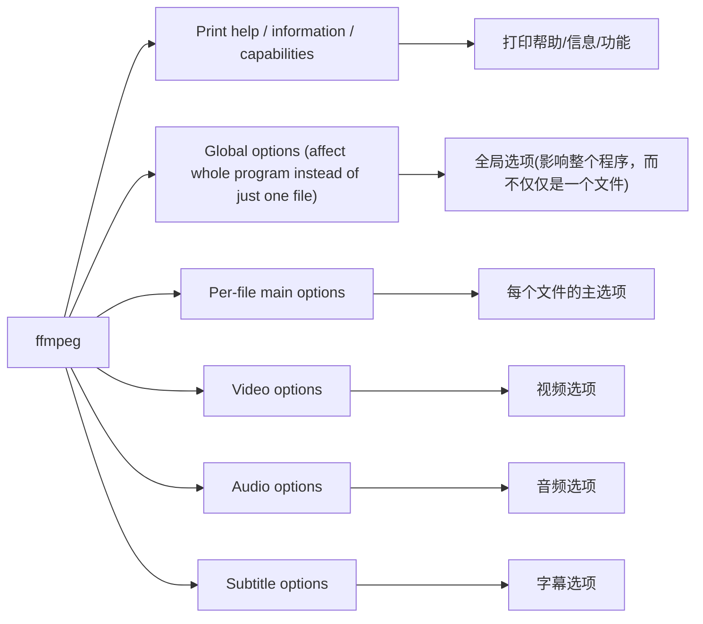

### ffmpeg命令使用
```sh
ffmpeg [全局选项] {[输入文件选项] -i 输入_url_地址} ...
 {[输出文件选项] 输出_url_地址} ...
```

如果你不想看 FFmpeg 标语和其它细节，而仅仅想看媒体文件信息，可以使用 `-hide_banner` 选项

```sh
Hyper fast Audio and Video encoder
usage: ffmpeg [options] [[infile options] -i infile]... {[outfile options] outfile}...

Getting help:
    -h      -- print basic options
    -h long -- print more options
    -h full -- print all options (including all format and codec specific options, very long)
    -h type=name -- print all options for the named decoder/encoder/demuxer/muxer/filter/bsf/protocol
    See man ffmpeg for detailed description of the options.
```

**ffmpeg命令参考**




1. **Print help / information / capabilities**

|			选项			|			含义				|
|:---------------------------|:-------------------------------|
|			-L				|			show license	    |
|			-h topic		|			show help	        |

1. **Per-file main options**\

|			选项				|			含义				|
|----				|			---				|
|			-t \<duration>				|			记录或转码音频/视频的“持续时间”秒	|
|			-to \<topic>		|			记录或转码停止时间	|
|			-fs \<limit_size>		|			设置以字节为单位的文件大小限制	|
|			-ss \<time_off>		|			设置开始时间偏移量	|

3. **Print help / information / capabilities:**

```sh
-L                  show license
-h topic            show help
-? topic            show help
-help topic         show help
--help topic        show help
-version            show version
-buildconf          show build configuration
-formats            show available formats
-muxers             show available muxers
-demuxers           show available demuxers
-devices            show available devices
-codecs             show available codecs
-decoders           show available decoders
-encoders           show available encoders
-bsfs               show available bit stream filters
-protocols          show available protocols
-filters            show available filters
-pix_fmts           show available pixel formats
-layouts            show standard channel layouts
-sample_fmts        show available audio sample formats
-dispositions       show available stream dispositions
-colors             show available color names
-sources device     list sources of the input device
-sinks device       list sinks of the output device
-hwaccels           show available HW acceleration methods
```

#### 查看输入文件格式
`ffprobe -show_format < input file >`

- color 是一种幕布，可以作为一个视频源，在文章一开始给的例子中，就作为一个视频源使用，它可以通过 d 参数设定它的持续时间。
- movie 导入视频源，可以视频视频或者图片作为视频源。
- overlay 叠加视频，可以指定叠加视频的相对位置
- concat 拼接视频，可以将视频进行拼接
- fifo 队列，用于排列视频，与concat 一同使用

### ffmpeg录屏
`ffmpeg -draw_mouse 0 -loglevel 48 -hide_banner -f x11grab -framerate 30 -video_size 1024x768 -i :0.0 -c:v libx264 -crf 18 -c:a aac -b:a 128k output.mp4`

- -f x11grab：指定输入格式为X11抓取（用于录制屏幕）。
- -draw_mouse 0：不绘制鼠标。
- -loglevel 48：设置日志等级48(debug:48;error:16;info:32)
- -hide_banner: 禁止打印
- -framerate 30：指定帧率为30帧每秒。
- -video_size 1024x768：指定视频大小为1024x768。
- -i :0.0：指定输入设备为X11显示器0（通常是主显示器）。
- -c:v libx264：指定视频编码器为H.264。
- -crf 18：指定视频质量为18（范围为0-51，越低质量越好）。
- -c:a aac：指定音频编码器为AAC。
- -b:a 128k：指定音频比特率为128kbps。
- output.mp4：指定输出文件名为output.mp4。

**注意** 对于开启x-server转发的应用来说,ffmpeg捕获不到数据,可使用xvfb创建虚拟x-server及DISPLAY显示
> `Xvfb -ac :99 -screen 0 1024x768x16 &` 虚拟的framebuffer x-server
> `xvfb-run -a --server-args="-screen 0 1920x1080x24" xrandr` 在虚拟x-server运行x-client命令