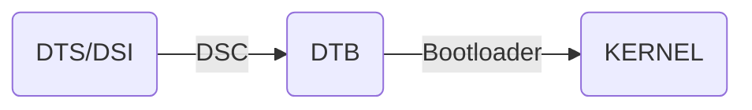

# linux系统构建sdk

一个完整的linux系统，通常包含了Uboot、kernel、设备树以及根文件系统。

> 参考文档
> - [野火linux镜像构建](https://doc.embedfire.com/lubancat/build_and_deploy/zh/latest/building_image/image_composition/image_composition.html)

## u-boot
u-boot(Universal Boot Loader, 通用引导加载程序)是一个适用于嵌入式linux的启动加载程序, 遵循GPL条款的开源项目。

> u-boot程序分为两个阶段(boot and loader):
- boot阶段: 启动系统，初始化硬件设备，建立内存空间映射图，将系统的软硬件带到一个合适的状态
- loader阶段: 将操作系统内核文件加载至内存，之后跳转到内核所在地址运行

[u-boot仓库](https://source.denx.de/u-boot/u-boot.git)
[u-boot文档](https://docs.u-boot.org/en/latest/build/gcc.html)

## linux kernel

linux kernel 是 Linux 操作系统的核心组件，负责管理系统硬件资源，并为应用程序提供基础服务

> Linux内核的主要模块分几个部分: 进程管理子系统、内存管理子系统、文件子系统、网络子系统、设备子系统等。

[linux kernel warehouse](https://git.kernel.org/pub/scm/linux/kernel/git/torvalds)

## 设备树

设备树是一种描述硬件的数据结构，它把这些硬件设备的信息以文件的形式记录，而这个文件，就是 `Device Tree(设备树)`

> 设备树包括 `DTS(Device Tree Source, 设备树源码)`; `DTC(Device Tree Compiler, 设备树编译工具)`; `DTB(Device Tree Blob, 二进制格式设备树)`
> 其中 `DTS` 包含的头文件格式为 `DTSI`

**注意**
Uboot和Linux不能直接识别 `DTS`, 而 `DTB` 可以被 `kernel` 与 `BootLoader` 识别解析, 通常在制作`NAND Flash`/`SD Card`的启动镜像时, 会为`DTB`留下一部分存储区域以存储, 在 `BootLoader` 启动 `kernel` 时, 会先读取 `DTB` 到内存, 再提供给内核使用.

> 设备树的编译过程


### 设备树结构

1. 根节点(Root Node), 形如
```dts
/ {
    compatible = "vendor,board";
    model = "Board Name";
};
```
2. CPU 节点
```dts
cpus {
    cpu@0 {
        compatible = "arm,cortex-a53";
        device_type = "cpu";
        reg = <0x0>;
    };
};
```
3. 内存节点:
```dts
cpus {
    cpu@0 {
        compatible = "arm,cortex-a53";
        device_type = "cpu";
        reg = <0x0>;
    };
};
```
4. 外设节点:
```dts
&i2c1 {
    status = "okay";
    touchscreen@38 {
        compatible = "edt,edt-ft5x06";
        reg = <0x38>;
    };
};
```

### 设备树示例

- `dtc -I dts -O dtb -o output.dtb input.dts` 编译设备树`input.dts`输出`output.dtb`
- `dtc -I dtb -O dts -o output.dts input.dtb` 反编译设备树
- `fdtdump output.dtb` 查看 `.dtb` 文件内容
- `dmesg | grep -i device-tree` 内核启动时检查设备树是否正确加载

### 一个设备树文件示例
```
node1 {
   a-string-property = "A string";
   a-string-list-property = "first string", "second string";
   a-byte-data-property = [0x01 0x23 0x34 0x56];

   child-node1 {
      first-child-property;
      second-child-property = <1>;
      a-string-property = "Hello, world";
   };
};
```

## 根文件系统
rootfs(root file system, 根文件系统)是linux在初始化时加载的第一个文件系统.

根文件系统包括根目录和真实文件系统.它包含系统引导和使其他文件系统得以挂载(mount)所必要的文件.

根文件系统包函Linux启动时所必须的目录和关键性的文件, 如: Linux启动时必要的初始化文件(在init目录下). 任何包括这些Linux系统启动所必须的文件都可以成为根文件系统.

> rootfs的kernel使用过程
> 1. linux启动的初始阶段, `bootloader` 会初始化一个基于内存的文件系统, 如`initramfs`/`initrd`等
> 2. `bootloader` 会以只读的方式去加载根文件系统(load rootfs)
> 3. `bootloader` 读取并且运行 `/sbin/init` 初始化程序(依次查找 `/init`;`/sbin/init`;`/etc/init`;`/bin/init`;`/bin/sh`)并根据 `/etc/inittab` 配置文件完成系统的初始化工作
> 4. 初始化的过程中, 还会以读写的方式重新挂载 `rootfs`, 这样在系统启动后, 根文件系统就可用于存储数据

**注意** 存在根文件系统是Linux启动时的必要条件

### 常见制作rootfs的工具及优缺点

常见的根文件系统有 `buildroot`/`Ubuntu`/`Debian`/`yocto`/`busybox`

> 优缺点列出如下

|rootfs name | 优点                                       | 缺点                 |
|------------|--------------------------------------------|----                 |
|buildroot   |构建简单,支持构建完整镜像                     |无包管理工具          |
|ubuntu      |构建方便, 支持包管理, ROS等机器人操作系统      |构建的文件系统较大     |
|debian      |构建方便, 支持包管理, 可视化界面               |构建的文件系统较大    |
|yocto       |支持框架多, 支持构建完整镜像                   |配置复杂             |
|busybox     |体积小, 支持常用命令, 常用于定制特定功能的小系统|无包管理工具, 功能不全 |

## example

### 米尔 MYD-YT113-I 开发板SDK

1. 从官方光盘镜像获取
2. 从托管的github仓库获取

[MYD-YT113 SDK V1.1.0下载地址](https://down.myir-tech.com/MYD-YT113/)
[全志托管github仓库](https://github.com/MYIR-ALLWINNER/myir-t1-manifest)

> 从github下载步骤, **注意** 需gitlab账号
```sh
mkdir $HOME/T113X
cd $HOME/T113X
export REPO_URL='https://mirrors.tuna.tsinghua.edu.cn/git/git-repo/' 
repo init -u git@github.com:MYIR-ALLWINNER/myir-t1-manifest.git --no-clone-bundle --depth=1 -m myir-t113-5.4.61-1.0.0.xml -b develop-yt113x-manifest 
repo sync 
```

#### 编译
> 以t113_i为例
> - `./build.sh config`; 选项:`0.linux --> 2.longan --> 0.linux-5.4 --> 1.t113_i --> 1.myir-image-yt113i-full --> 1.nor --> 0.gnueabi`
> - `export set FORCE_UNSAFE_CONFIGURE=1` 解决root用户编译的安全错误
> - 修改 ` ./out/t113/ myir-image-yt113s3-emmc-full /longan/buildroot/build/host-libglib2-2.56.3/gio/gdbusauth.c` 在 `debug_print ("SERVER: WaitingForBegin, read '%s'", line);` 语句上添加判断条件 `if (line != NULL)`
> - 修改 `./out/t113/ myir-image-yt113s3-emmc-full /longan/buildroot/build/host-libglib2-2.56.3/gio/gdbusmessage.c` 在 `tupled_signature_str = g_strdup_printf ("(%s)", signature_str);` 语句上添加判断条件 `if (signature_str != NULL)`
> - 在 `out/t113_i/evb1_auto/longan/buildroot/build/libgpg-error-1.33/src` 下将所有 `namespace` 替换为 `pkg_namespace`, 命令: `grep -rl "namespace" out/t113_i/evb1_auto/longan/buildroot/build/libgpg-error-1.33/src/ | xargs sed -i 's/namespace/pkg_namespace/g'`

### 使用docker+qemu构建板级开发环境

> 参考文档:
- [qemu启动树莓派模拟板](https://github.com/dhruvvyas90/qemu-rpi-kernel)
- [docker搭建树莓派Raspbian](https://github.com/lukechilds/dockerpi)

#### dockerpi的树莓派容器

- `lukechilds/dockerpi`拉取docker镜像
- `docker run -it -v $HOME/.dockerpi:/sdcard lukechilds/dockerpi [pi1|pi2|pi3]` 启动容器
> 使用特定镜像放到`$HOME/.dockerpi/`下,重命名为`filesystem.img`
> 2022.4月份之后的raspberrypi镜像, 默认密码不为pi:raspberry, 挂载img镜像文件boot分区(一般为第一个分区`fdisk -l `查看挂载偏移),添加`userconf.txt`文件,内容`pi:$6$/4.VdYgDm7RJ0qM1$FwXCeQgDKkqrOU3RIRuDSKpauAbBvP11msq9X58c8Que2l1Dwq3vdJMgiZlQSbEXGaY5esVHGBNbCxKLVNqZW1`
> 自定义密码密文使用`openssl passwd -6 -stdin -salt "123456"`获取, 添加`$6$`指定SHA-512单向加密, 椒盐`123456`在第三个$之前,后接密文;形如`<username>:$6$<salt>$<ciphertext>`

### 磁盘镜像文件img扩容
> 在使用img作为磁盘镜像时, 受文件大小的影响, 空间很容易占满, 因此需要对其进行扩容
1. `dd if=/dev/zero bs=1G count=3 >> filesystem.img`
2. `fdisk -l filesystem.img`
3. `fdisk filesystem.img`
> - `d 2`
> - `n p 2`
> - `<start_point>`
> - `<end_point>`
> - `w`
4. `sudo mount -o loop,offset=<start_point*block_size> filesystem.img ./tmp`
5. `sudo losetup -a | grep "filesystem.img"`
6. `sudo resize2fs  /dev/loop6`
7. `sudo losetup -d /dev/loop6`
8. `qemu-img resize -f raw filesystem.img 8G`

## 构建bug

### kernel dtc编译构建设备树dt-binds头文件目录未找到

linux kernel内核源码中, 存在 `scripts/dtc/include-prefixs` 目录存放设备树编译相关的头文件, 均以符号链接的方式相对指向上级目录(不止一层)
